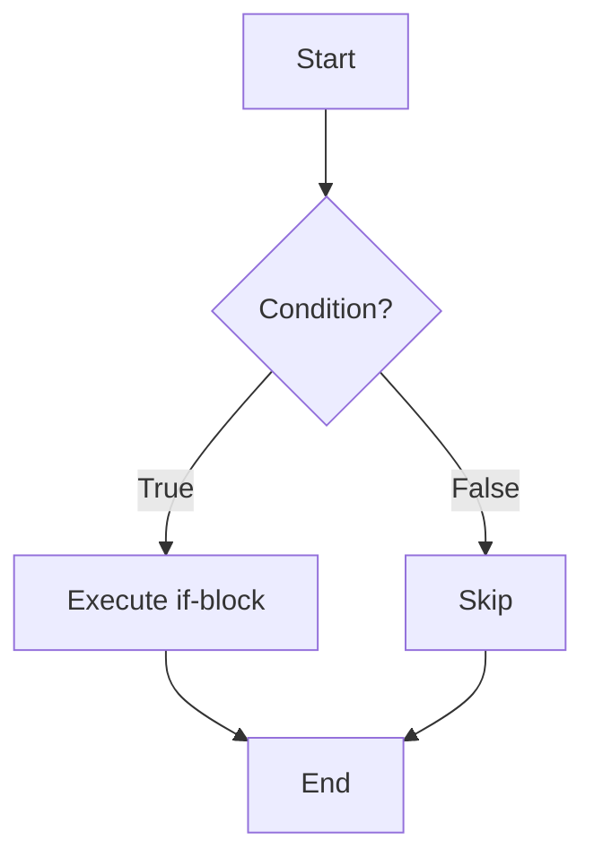
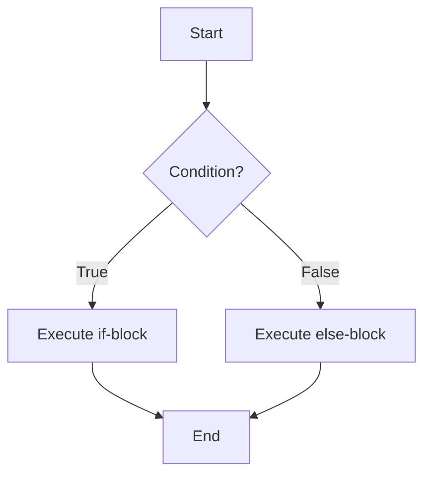
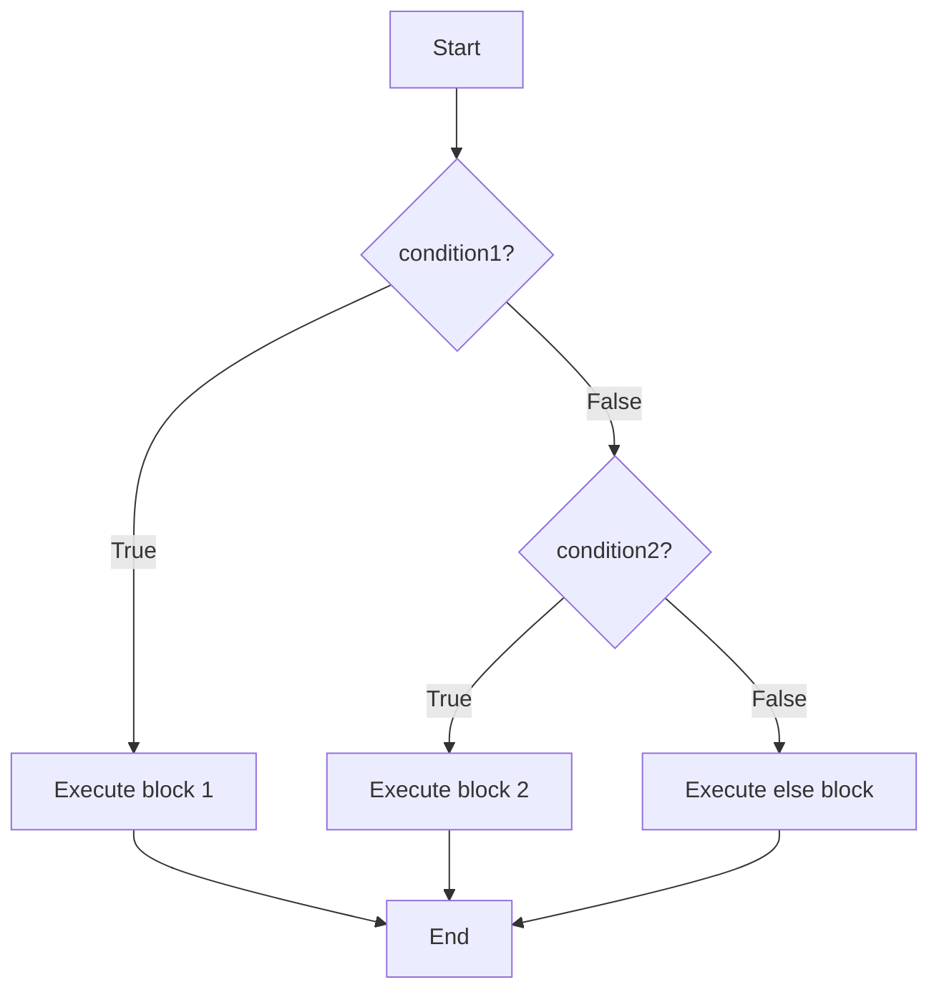
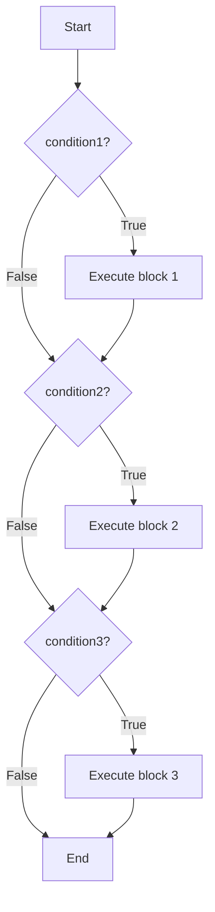
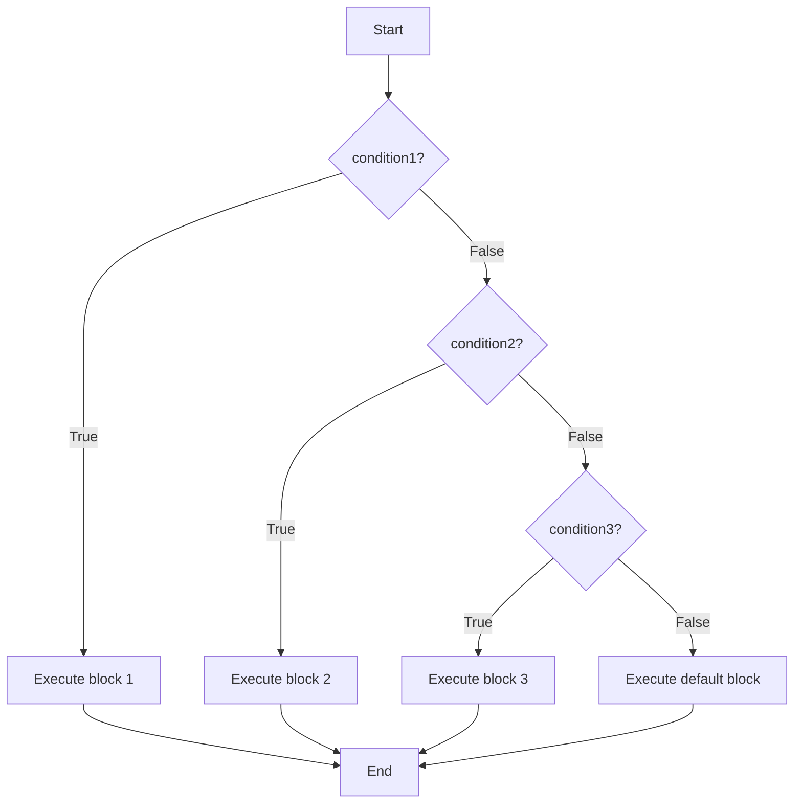
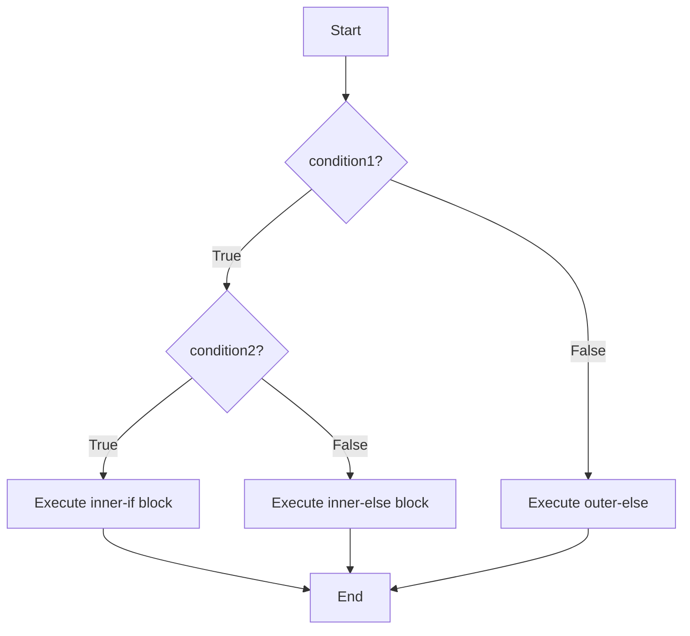
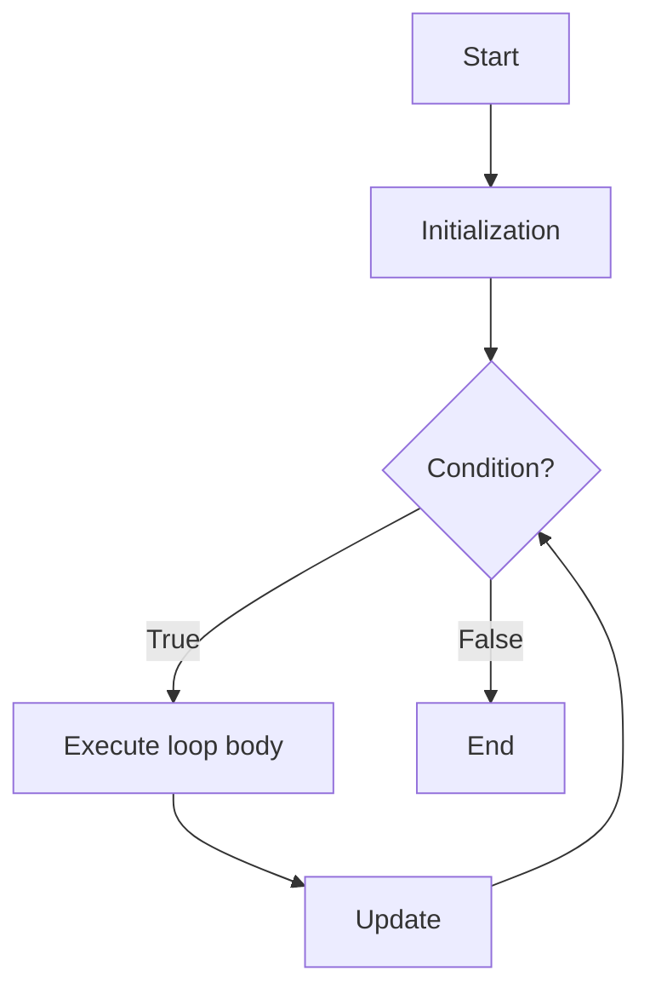
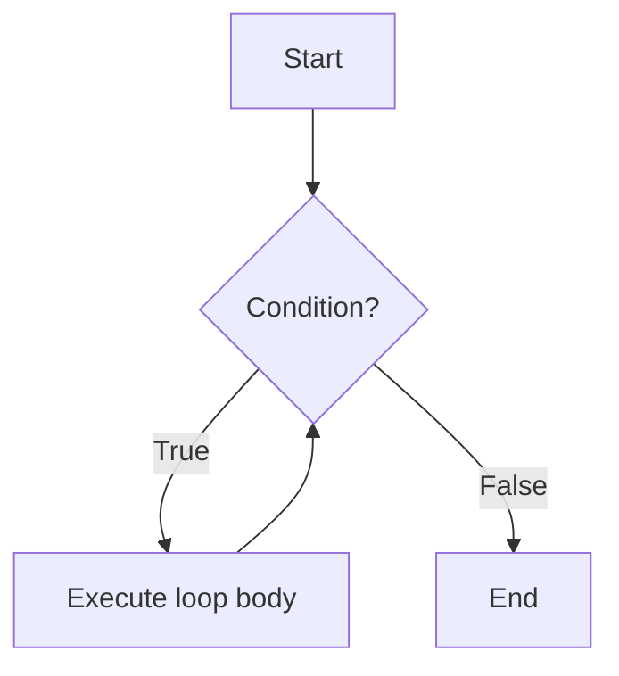
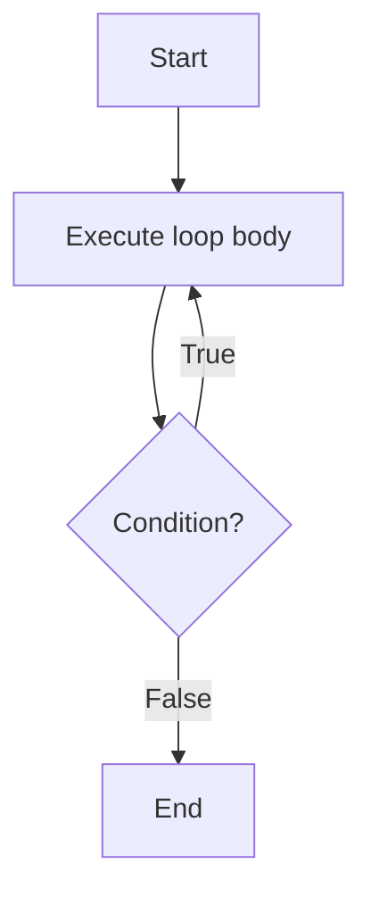

# Task 05 

## Control Flow Statements/ Decision Making Path

1. `if/ if-else/ if-if ladder/ if-else-if ladder/ nested if`

* `if Statement` : checkes whether the condition written is true if the executes the code written inside if block.

### Diagram


* `if - else` : executes else code when if codition was false.

### Diagram


* `if-else-if` (Single Chain, Two Conditions)

Checks a second condition only if the first is false, then falls back to else. This is the basic building block of a ladder.

### Diagram


* `if` Ladder (Series of Independent `if` Statements)

Every if is checked independently . Multiple blocks can execute if multiple conditions are true.

### Diagram


* `if-else-if` Ladder (Chained, Mutually Exclusive)

A chain of conditions where **only one** block executes — the first true condition wins, and the rest are skipped.

### Diagram


* Nested `if`

An `if` (or `if-else`) statement placed **inside** another `if` (or `else`) block. Used when a second condition only matters if the first is already true.

### Diagram


2. `Switch-Case statemnt : it also helps in decision making` 

## LOOP Statements:

* `for` Loop

Used when the **number of iterations is known** in advance. Initialization, condition, and update are all in one line — condition is checked **before** each iteration (entry-controlled).

### Syntax
```c
for (initialization; condition; update) {
    // loop body
}
```

### Diagram


* `while` Loop

Used when the number of iterations is **not known in advance** and depends on a condition. Condition is checked **before** each iteration (entry-controlled) — body may run **zero** times.

### Diagram


* `do-while` Loop

Similar to `while`, but the condition is checked **after** each iteration (exit-controlled) — body always runs **at least once**, even if the condition is false initially.

### Syntax
```c
do {
    // loop body
} while (condition);
```

### Diagram


3. `BLock Statements & Variable Scope` : 

Variable Scope in JAVA is thoda different no variable is global can be static but not global.
BLock Statement helps in identifying the scope and lifetime of the variable.
the variable cannot be access outside the block statement in which it has declared or define

4. `Algorithm Writing and Refinement also Pseudo Code` :
- we write algorithm at the time of designing, it is a step by step procedure of solving a particular problem.
-  Algo Refinement is to break the bigger problem into very samll small steps (single unit) so that it will be easy to find the solution.
- Psedo code is a type of writing an algorithm, we write algo in a simple human readable english language, each step is define in it. it is independent of any programming lang.
- Properties of a GOOD ALGO
1. Finite
2. Unambiguous
3. Definite
4. Input
5. Output
6. Time 


