### Q1. Rohan (a boy) says, "Priya is the daughter of my mother's only son." How is Priya related to Rohan?
* Answer: Daughter

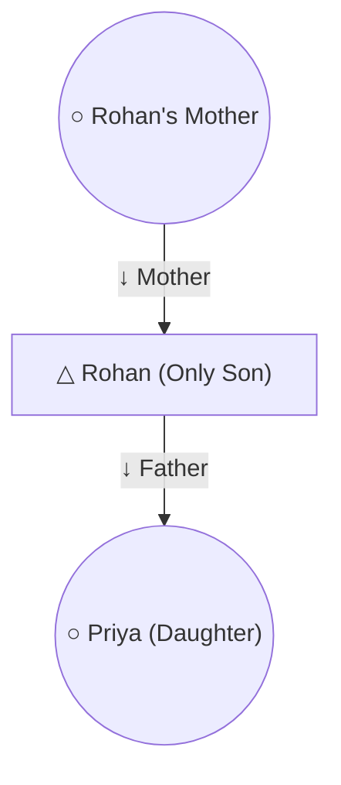

### Q2. Pointing to a boy, Neha says, "He is the son of my Dada's only son." How is the boy related to Neha?
* Answer: Brother
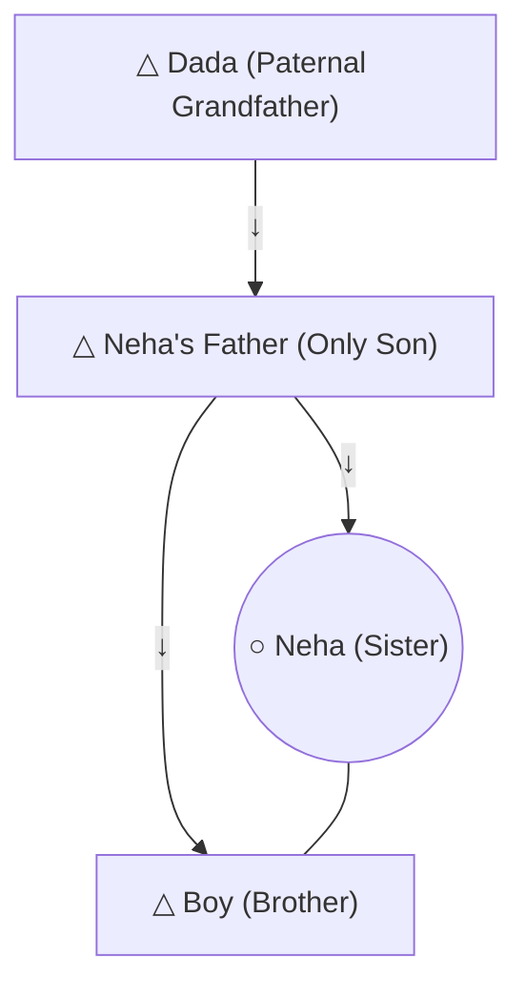

### Q3. Introducing a girl, Amit says, "Her mother is the only daughter of my mother." How is Amit related to the girl?
* Answer: Maternal Uncle 
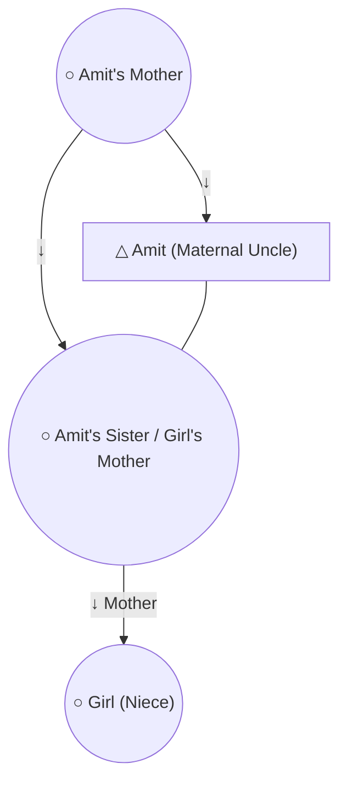

### Q4. Pointing to a boy, Anjali says, "His mother is the only daughter of my mother." How is Anjali related to the boy? (Comparison with Q3)
* Answer: Mother

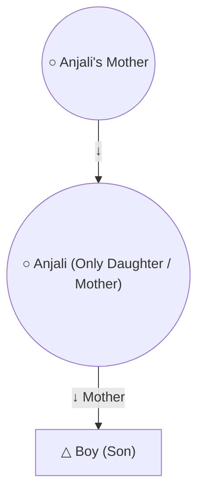

### Q5. X is the brother of Y. Y is the sister of Z. Z is the father of W. How is X related to W?
* Answer: Paternal Uncle
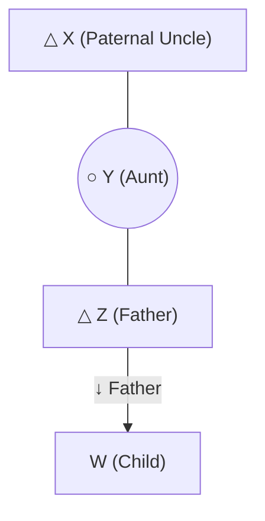

### Q6. A is the sister of B. C is the mother of B. D is the father of C. E is the mother of D. How is A related to D?
* Answer: Granddaughter (Maternal Granddaughter)
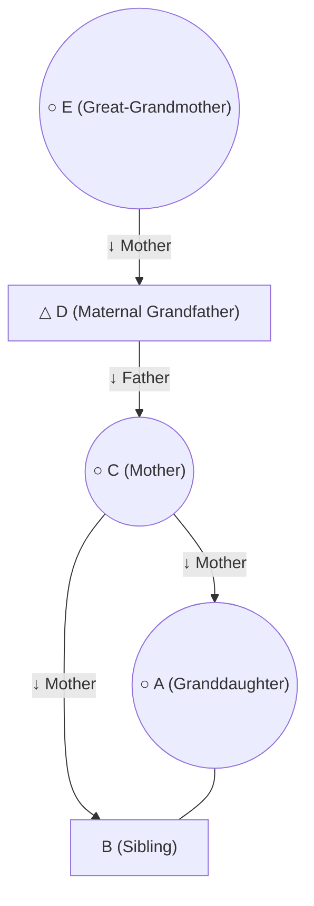

### Q7. Pointing to a lady, Rahul says, "She is the daughter of the woman who is the mother of my mother's husband." How is the lady related to Rahul?
* Answer: Paternal Aunt

### Q8. Showing a photo of a boy, Kavya (a girl) says, "His father is the only son of my father." How is Kavya related to the boy?
* Answer: Mother-in-law (Saas)
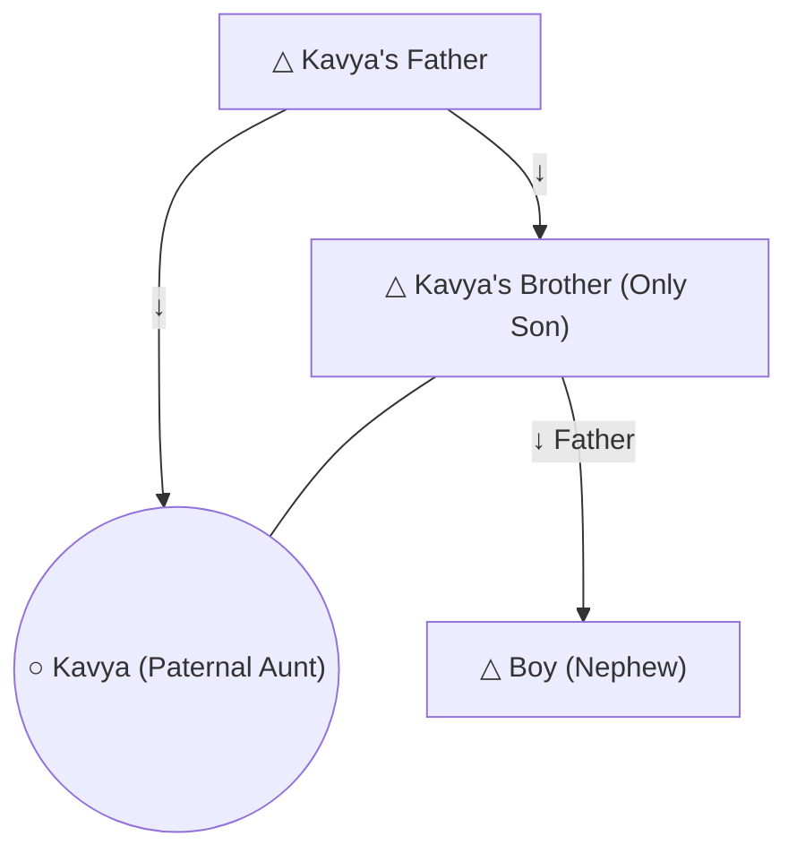

### Q9. Vikas says, "Aman is the son of the wife of my father's only brother." How is Aman related to Vikas?
* Answer: Cousin
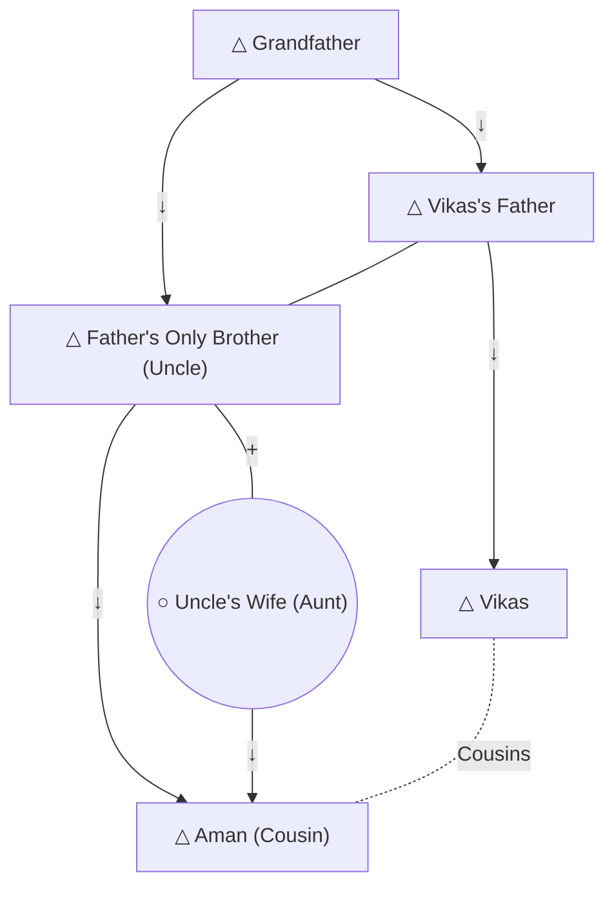

### Q10. Pointing to a woman, Deepak says, "Her son's wife is the daughter of my father's only son." How is the woman related to Deepak's daughter?
* Answer: Mother-in-law (Saas)
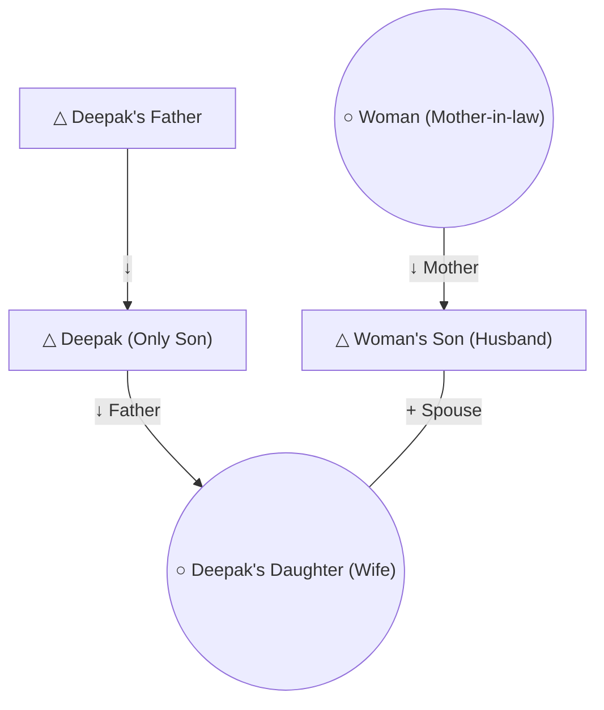

### Q11. If A \ B + C, how is A related to C?
* Answer: Sister
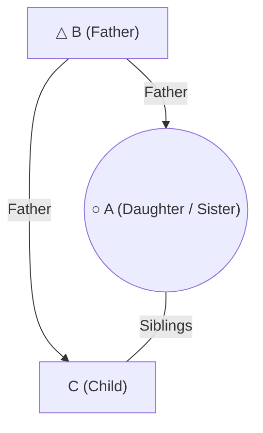

### Q12. If M − N + O x P, how is M related to P?
Answer: Mother
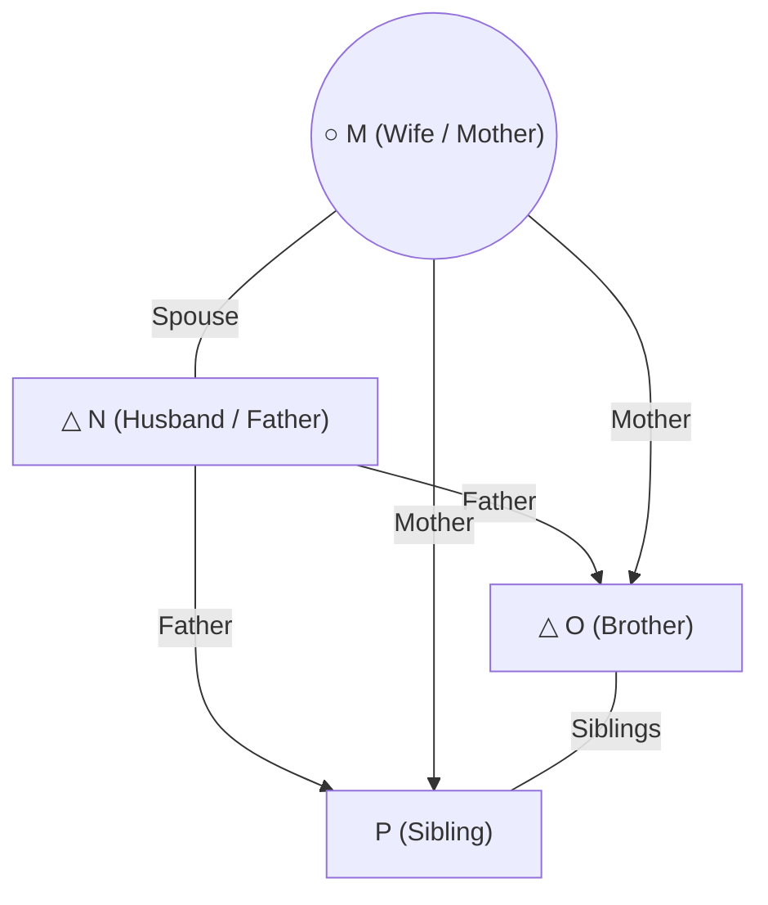

### Q13. Which expression shows that R is the grandfather of T?
Answer: (a) R + S + T
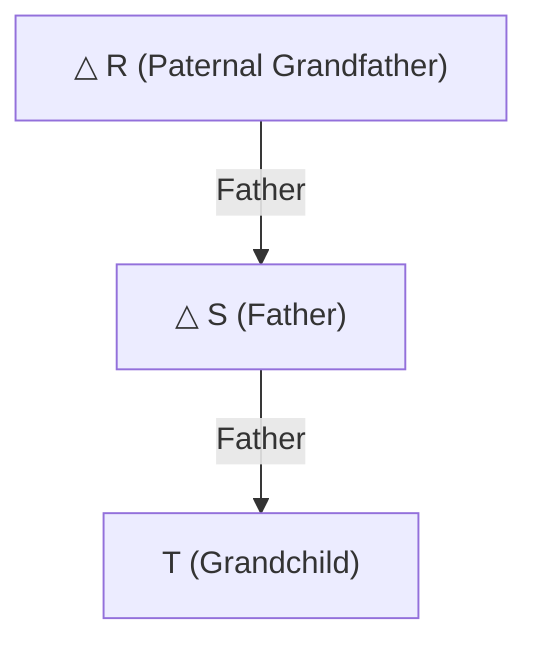

### Q14. How is Kabir related to Ravi?
* Grandson
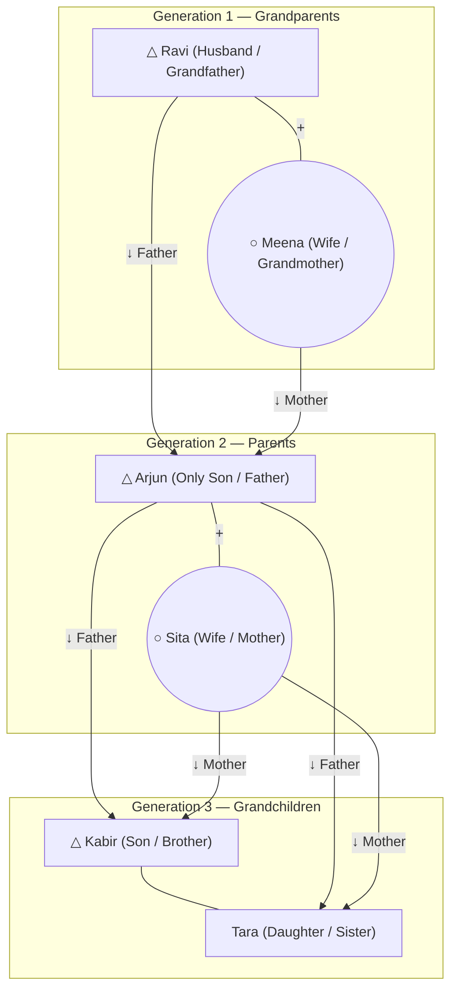

### Q15. How is Ravi related to Sita?
* Answer: Father-in-law
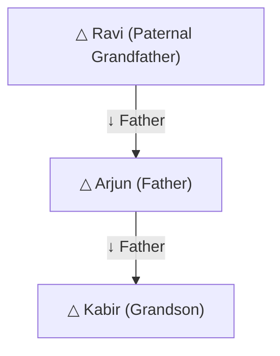