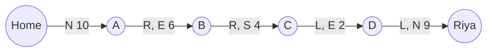
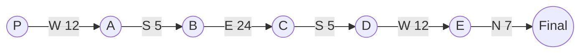
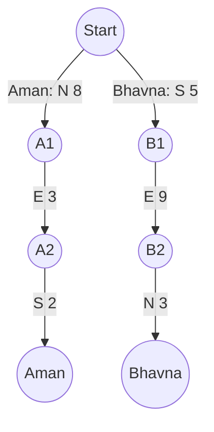
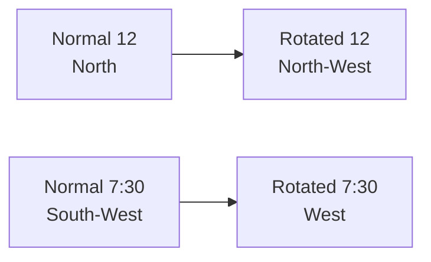
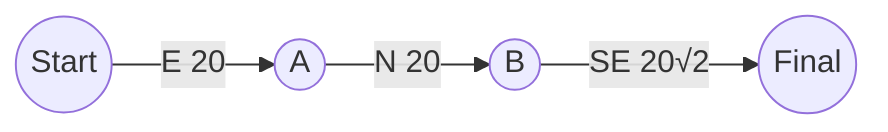
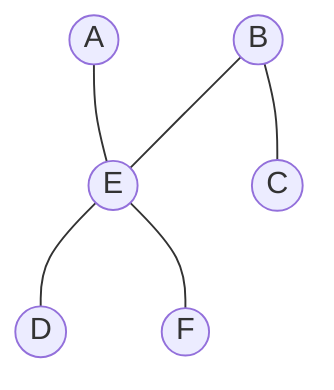
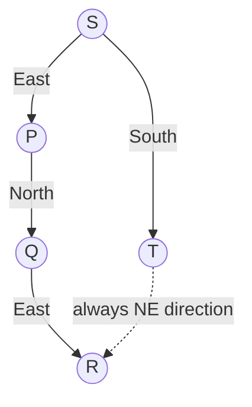
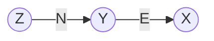
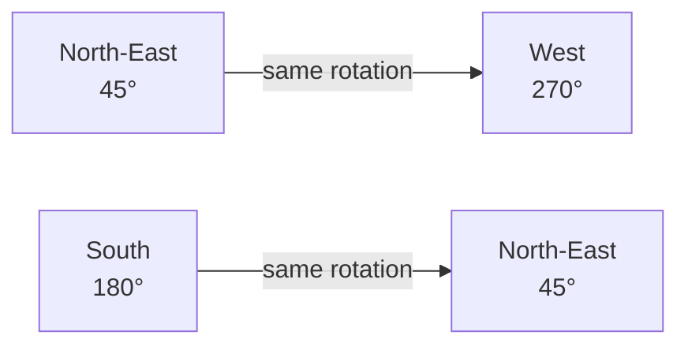
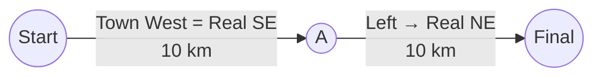

# Direction Sense — Answers, Key Concepts & Mermaid Diagrams

## Answer Key

| Q | Correct Answer | Your Answer | Result |
|---|---|---|---|
| 1 | **(c)** 17 km North-East; facing North | c | ✅ |
| 2 | **(a)** 4√2 m South-West; facing South | — | — |
| 3 | **(d)** 3 m South | d | ✅ |
| 4 | **(b)** 10 km; Bhavna is South-East of Aman | b | ✅ |
| 5 | **(d)** South-East | d | ✅ |
| 6 | **(a)** South | a | ✅ |
| 7 | **(d)** West | d | ✅ |
| 8 | **(b)** 40 m East | b | ✅ |
| 9 | **(a)** 5 km North-East; 5 km | a | ✅ |
| 10 | **(c)** 5√2 m North-East; E | c | ✅ |
| 11 | **(b)** North-East | b | ✅ |
| 12 | **(d)** 5 m East | d | ✅ |
| 13 | **(b)** X # Y $ Z | b | ✅ |
| 14 | **(a)** North-East | b | ❌ |
| 15 | **(c)** 10√2 km East | c | ✅ |

**Score based on the answers you supplied:** 13/15 attempted correct.  
(Q2 was tried but not got any ans).

---

# Level 1 — Multi-turn Walks

## Q1

**Given:** Riya walks:
- 10 km North
- Right → 6 km East
- Right → 4 km South
- Left → 2 km East
- Left → 9 km North

### Coordinate method

Take home as `(0,0)`.

- North 10 → `(0,10)`
- East 6 → `(6,10)`
- South 4 → `(6,6)`
- East 2 → `(8,6)`
- North 9 → `(8,15)`

So:

- Horizontal displacement = 8 km East
- Vertical displacement = 15 km North
- Distance = √(8² + 15²) = **17 km**
- Direction = **North-East**
- Final facing direction = **North**

### Answer

**(c) 17 km North-East; facing North**

### Key concept
Use a coordinate grid. Right/left turns are relative to the person's **current facing direction**, not the fixed page direction.

---

## Q2

The robot starts facing East and follows:

1. East 1
2. Left → North 2
3. Left → West 3
4. Left → South 4
5. Left → East 5
6. Left → North 6
7. Left → West 7
8. Left → South 8

### Coordinate method

Starting at `(0,0)`:

- E 1 → `(1,0)`
- N 2 → `(1,2)`
- W 3 → `(-2,2)`
- S 4 → `(-2,-2)`
- E 5 → `(3,-2)`
- N 6 → `(3,4)`
- W 7 → `(-4,4)`
- S 8 → `(-4,-4)`

Distance:

`√((-4)² + (-4)²) = √32 = 4√2 m`

Direction = **South-West**

After the 8th move, the robot is moving/facing **South**.

### Answer

**(a) 4√2 m South-West; facing South**

### Key concept
For repeated left turns, the facing directions cycle:

**East → North → West → South → East...**

---

## Q3

Karan starts at P:

- West 12
- Left from West → South 5
- Left from South → East 24
- Right from East → South 5
- Right from South → West 12
- Right from West → North 7

### Net displacement

Horizontal movement:

`-12 + 24 - 12 = 0`

Vertical movement:

`-5 - 5 + 7 = -3`

Therefore he is **3 m South** of P.

### Answer

**(d) 3 m South**

### Key concept
Cancel movements in opposite directions before calculating the final distance.

---

## Q4

### Aman

- N 8 → `(0,8)`
- E 3 → `(3,8)`
- S 2 → **`(3,6)`**

### Bhavna

- S 5 → `(0,-5)`
- Left while facing South = E 9 → `(9,-5)`
- Left while facing East = N 3 → **`(9,-2)`**

From Aman `(3,6)` to Bhavna `(9,-2)`:

- East = 6
- South = 8

Distance:

`√(6² + 8²) = 10 km`

Direction = **South-East**

### Answer

**(b) 10 km; Bhavna is South-East of Aman**

### Key concept
For relative-position questions, calculate both people's final coordinates first, then subtract.

---

# Level 2 — Degrees, Shadows and Clocks

## Q5

Neeraj starts facing **North-East**.

Use clockwise angles from North:

- NE = 45°
- +135° clockwise → 180° = South
- −270° anticlockwise → 90° = East
- +45° clockwise → 135° = South-East

### Answer

**(d) South-East**

### Key concept
Reduce angles modulo 360° and use the person's current facing direction.

---

## Q6

It is just before sunset, so the Sun is in the **West**.

A shadow falls opposite the Sun, so Tanya's shadow points **East**.

The shadow is exactly to **Sameer's left**.

If East is to a person's left, that person must be facing **South**.

### Answer

**(a) South**

### Key concept
At sunset:

**Sun → West**

**Shadow → East**

Then determine the person's facing direction from the left/right relationship.

---

## Q7

At 3:00 PM, the minute hand normally points in the 3 o'clock direction, while the hour hand points North.

The minute hand is therefore 90° clockwise from the hour hand.

Given that the minute hand points **North-East**, the hour hand at 3:00 points **North-West**.

The whole clock is therefore rotated so that its normal North direction corresponds to North-West.

At 7:30, the hour hand normally points **South-West**.

Apply the same rotation: South-West rotated 45° clockwise becomes **West**.

### Answer

**(d) West**

### Key concept
First establish the clock's rotation using a known time. Then apply the same rotation to the required hand position.

---

## Q8

Pooja:

- East 20 → `(20,0)`
- Left from East = North 20 → `(20,20)`
- Left from North = West, but she turns **135° clockwise**, so from North she faces **South-East**.
- Distance `20√2` at 45° gives components 20 East and 20 South.

Final position:

`(20,20) + (20,-20) = (40,0)`

Therefore she is **40 m East**.

### Answer

**(b) 40 m East**

### Key concept
A diagonal movement of `20√2` at 45° has components **20 m horizontal + 20 m vertical**.

---

# Level 3 — Relative Positions

## Q9

Set P = `(0,0)`.

- Q = `(6,0)`
- R = `(6,8)`
- S = `(0,8)`
- T = `(0,4)`
- U = `(3,4)`

### U from P

Distance:

`√(3² + 4²) = 5 km`

Direction = **North-East**.

### U from Q

Q = `(6,0)`, U = `(3,4)`.

Difference = `(-3,+4)`.

Distance:

`√(3² + 4²) = 5 km`

Direction = North-West.

The question asks only the distance for part (ii).

### Answer

**(a) (i) 5 km North-East; (ii) 5 km**

### Key concept
Use the 3-4-5 right triangle whenever horizontal and vertical displacements are 3 and 4.

---

## Q10

Let B = `(0,0)`.

- A is 10 m West of B → `(-10,0)`
- C is 10 m South of B → `(0,-10)`
- D is 10 m East of C → `(10,-10)`
- E is midway between A and D:

`((-10 + 10)/2, (0 - 10)/2) = (0,-5)`

Thus E is exactly midway between B `(0,0)` and C `(0,-10)`.

- F is 5 m East of E → `(5,-5)`

From C `(0,-10)` to F `(5,-5)`:

- 5 m East
- 5 m North

Distance = `5√2 m`

Direction = **North-East**

### Answer

**(c) (i) 5√2 m North-East; (ii) E**

### Key concept
"Exactly midway" means take the average of the two coordinates.

---

## Q11

Take P at `(0,0)`.

Let:

- Q = `(0,q)` where `q > 0`
- R = `(r,q)` where `r > 0`
- S = `(-s,0)` where `s > 0`
- T = `(-s,-t)` where `t > 0`

From T to R:

- East displacement = `r + s`, which is positive.
- North displacement = `q + t`, which is positive.

Therefore R is always **North-East** of T.

### Why distances do not matter

No matter what positive values the distances have, R is reached from T by moving:

- some positive distance East, and
- some positive distance North.

Therefore the quadrant is always North-East.

### Answer

**(b) North-East**

### Key concept
When no distances are given, use the **sign of the displacement**, not its magnitude.

---

# Level 4 — Coded Directions

## Code Table

| Symbol | Meaning |
|---|---|
| `P $ Q` | P is 5 m North of Q |
| `P # Q` | P is 5 m East of Q |
| `P @ Q` | P is 5 m South of Q |
| `P % Q` | P is 5 m West of Q |

---

## Q12

Expression:

`A $ B # C @ D`

Read from right to left as relationships:

- `C @ D` → C is 5 m South of D.
- `B # C` → B is 5 m East of C.
- `A $ B` → A is 5 m North of B.

Let D = `(0,0)`.

- C = `(0,-5)`
- B = `(5,-5)`
- A = `(5,0)`

So A is **5 m East** of D.

### Answer

**(d) 5 m East**

### Key concept
Translate each symbol into a coordinate movement and add the vectors.

---

## Q13

We need X to be North-East of Z.

### Option (b)

`X # Y $ Z`

- X # Y → X is East of Y.
- Y $ Z → Y is North of Z.

Therefore X is both **East and North** of Z.

So X is **North-East** of Z.

### Answer

**(b) X # Y $ Z**

### Key concept
Combine horizontal and vertical movements. East + North = North-East.

---

# Level 5 — Rotated Compass

## Q14

Given:

**North-East becomes West.**

Using standard angles:

- North = 0°
- North-East = 45°
- West = 270°

So the transformation is:

`45° → 270°`

That is a rotation of **225° clockwise**, equivalently **135° anticlockwise**.

Apply the same transformation to South:

- South = 180°
- 180° + 225° = 405°
- 405° − 360° = 45°

45° = **North-East**.

### Answer

**(a) North-East**

Your answer **(b) North-West is incorrect**.

### Key concept
When every direction changes in the same manner, apply the **same angular rotation** to every direction.

---

## Q15

We are told:

> Real North is called South-East.

So the town's naming system is rotated.

Using angles:

- Real North = 0°
- Named South-East = 135°

Therefore:

**Named direction = Real direction + 135°**

To find the real direction corresponding to the town's **West**:

- Named West = 270°
- Real direction = `270° − 135° = 135°`
- 135° = **South-East**

So the first 10 km is really **South-East**.

He then turns left.

From South-East, a 90° anticlockwise turn gives **North-East**.

Thus:

- 10 km South-East
- 10 km North-East

The South and North components cancel.

East components add:

`10/√2 + 10/√2 = 10√2 km`

Therefore the final displacement is **10√2 km East**.

### Answer

**(c) 10√2 km East**

### Key concept
Separate the **renamed direction system** from the **real direction system**. First decode the named direction into a real direction; only then apply the physical left/right turn.

---

# Final Revision: Direction-Sense Concepts

## 1. Coordinate method

Use:

- North = `+Y`
- South = `−Y`
- East = `+X`
- West = `−X`

For example:

`(+3,+4)` = North-East

`(-3,+4)` = North-West

`(+3,-4)` = South-East

`(-3,-4)` = South-West

## 2. Right and left turns

Always turn relative to the **current facing direction**.

| Facing | Right turn | Left turn |
|---|---|---|
| North | East | West |
| East | South | North |
| South | West | East |
| West | North | South |

## 3. Distance formula

For horizontal displacement `x` and vertical displacement `y`:

**Distance = √(x² + y²)**

Common triangles:

- 3-4-5
- 5-12-13
- 8-15-17

## 4. Diagonal movements

At 45°:

- `d` along NE gives `d/√2` East + `d/√2` North.
- `20√2` at 45° gives 20 East + 20 North.

## 5. Shadows

At sunset:

- Sun = West
- Shadow = East

At sunrise:

- Sun = East
- Shadow = West

Then use the person's left/right relationship.

## 6. Clock-direction problems

First determine how the clock is rotated from a known time. Then apply the **same rotation** to the required hand position.

## 7. Coded directions

Convert each code symbol into a vector:

- `$` = North
- `#` = East
- `@` = South
- `%` = West

Then add the vectors.

## 8. Renamed/rotated directions

Do not confuse a **new name** with a physical direction.

Decode:

**named direction → real direction**

Then perform the requested physical movement/turn.

---

# Corrected Answer Key

**1-C, 2-A, 3-D, 4-B, 5-D, 6-A, 7-D, 8-B, 9-A, 10-C, 11-B, 12-D, 13-B, 14-A, 15-C**
